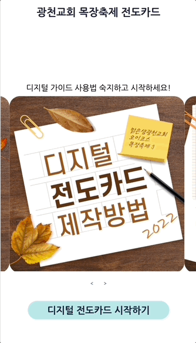
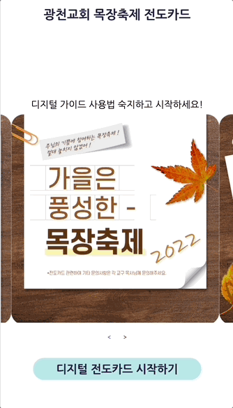

## 프로젝트 소개

**메시지 카드 메이커**

배경 이미지와 마음에 드는 성경 구절을 골라 메시지를 작성해 이미지를 저장하는 웹 서비스입니다.

## 기술 스택

- HTML
- CSS
- React
- Figma

## 구현 기능

🌆 배경 이미지 선택

⛪ 성경 구절 선택

💬 메시지 작성

⬇️ 이미지 저장

## 화면

시작 전 사용법 전달 화면

메시지 생성 화면

## 배운 점 & 아쉬운 점

😄

1. 노트북 사이즈와 모바일 사이즈를 모두 고려하여 CSS @media 태그를 이용해 개발하는 방법을 배웠다.
2. 화면의 DOM 요소를 이미지로 저장하는 라이브러리인 html2canvas를 사용했다.
3. Recoil 상태관리 라이브러리를 이용해 사용자가 선택한 배경 이미지와 성경 구절 데이터를 컴포넌트에서 적절하게 사용할 수 있었다.

☹️

1. 다양한 이미지 저장 라이브러리(dom-to-image, html-to-image)가 있는데, 화면의 이미지를 저장할 수 없어서 적합한 라이브러리를 찾는데 시간 낭비를 했다.
2. 예상 사용자를 고려하지 않고 글씨 크기를 작게 개발한 점이 아쉽다. 예상 사용자에 맞게 서비스를 구상해야 한다는 점을 배웠다.
3. 서버와 통신할 필요 없이 사용자가 화면에서 조작하면 되는 서비스라 생각보다 간단했다.

## 개선 방향

1. 다양한 폰트 선택 기능
2. 이미지 저장할 필요 없이 바로 상대방에게 전달하는 기능
